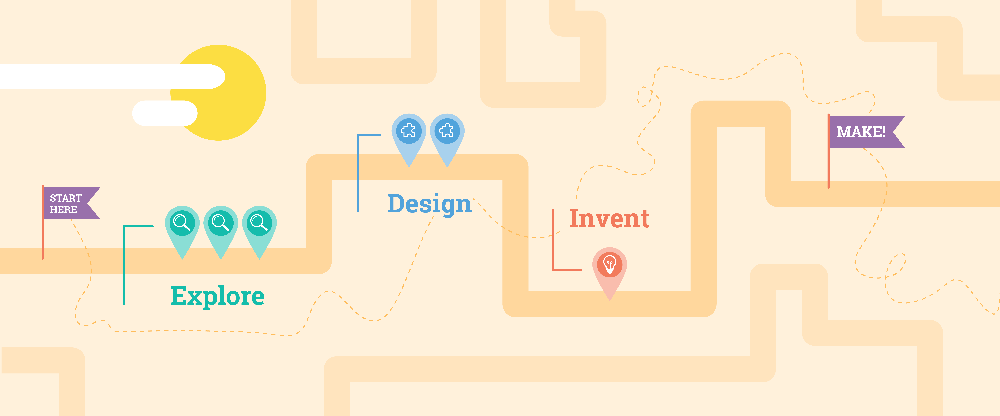

## Why 321 Make! ?

While designing the new format for our projects, we found that, as well as support and opportunities to practise while acquiring new skills and knowledge, creators need a learning journey that lets them gradually develop and demonstrate increasing independence. 

321 Make! is informed by research into how young people develop interest and skills in computing as well as the experiences of the Raspberry Pi Foundation, Code Club and CoderDojo. 

### Developing an identity

When creators work through the projects in a 321 Make! path, we want them to be able to say:

+ I can make things that matter to me
+ I can find things out that I need to know
+ I believe that computing and digital making is important to be
+ I belong to a maker community
+ I am a maker

### Key principles of 321 Make!

The 321 Make! [framework](https://www.raspberrypi.org/blog/free-coding-resources-children-young-people-digital-making-independence/){:target="_blank"}: 

+ Prioritises fun and engagement
+ Links to the modern world
+ Leads with outcomes
+ Builds independence
+ Prepares for success
+ Encourages personalisation
+ Incorporates professional practises
+ Includes physical computing
+ Supports sharing 
+ Encourages reusing and remixing
+ Introduces role models
+ Provides reflection time
+ Is designed for all 

--- collapse ---
---
title: Further reading
---

+ **Prioritises fun and engagement**

Engagement provides better opportunities for self-motivated learning and gives young people the desire to return to continue participating in educational activities themed around their interests. We look at what young people are making and tailor our projects around our findings.

+ **Links to the modern world**

Computing technology is shaped by the people who make it. Relating projects to the modern world enables young people to discover how the technology around them works and how it was created. We explain what technology professionals do and encourage users to make connections between what they are learning and the technology around them. 

+ **Leads with outcomes**

Young people need to be excited about what they are about to do in order to build their motivation. It is important that they understand why they are doing something before they make a start. Projects begin with examples that young people can investigate and be inspired by. Each project is then broken down into steps which clearly show what they are about to achieve. 

+ **Builds independence**

Learners need to develop independence so they can make projects that are unique to them and have never been made before. We build independence gradually. Explore projects include step-by-step instructions for new skills and concepts to develop familiarity and competence with using tools. Design projects show learners how to solve problems themselves and develop the skills to keep learning new technologies. Invent projects allow learners to meet a project brief using their creativity, design thinking and technical skills. 

+ **Prepares for success**

In order to develop independence, learners need to develop a set of skills and knowledge to design and invent their own projects. The skills and knowledge covered in the explore projects are carefully considered to provide learners with the ability to quickly make interesting projects. 

+ **Encourages personalisation**

When learners are making things that matter to them they will be motivated to keep going because the context is meaningful to them. We design projects that are open enough to be adapted to young people's life experiences and culture. 

+ **Incorporates professional practises**

Making with technology requires practises such as debugging, testing and creative thinking and the ability to consider user needs. It also involves using tools such as code editors. Explore projects model and narrate best practices. Design projects guide learners through the development process and Invent projects enable learners to demonstrate their skills independently in a context where they can succeed. 

+ **Includes physical computing**

Physical computing gives tactile and sensory experiences to enhance learning. Combining electronics and programming with arts and crafts provides learners with a creative, engaging context to explore and apply computing concepts. Making devices that provide practical solutions to physical problems can be motivating.

+ **Supports sharing**

Sharing fosters a sense of community, mutual support and positivity.  Opportunities to share online or in-person are built into the structure of the projects. Creators are encouraged to ask for feedback on their work.  

+ **Encourages reusing and remixing**

Professional software developers reuse code and look things up all the time. Programmers don't remember everything (and nobody asks a mechanic to make the engine parts they use when building an engine - the skill is knowing how to put them together!).

+ **Introduces role models**

It's very important that young people see themselves represented in computing as they form their own identity as digital makers and make plans for their future education and careers. Projects introduce role models from a variety of backgrounds in a range of industries. 

+ **Provides reflection time**

Reflection is built into each project and  is another opportunity to cover the key skills and knowledge that young people have discovered in their projects. It helps to embed the skills for when they need them later on.

+ **Is designed for all**

Projects are written for an audience that is global and has a wide variety of contexts and needs.  

--- /collapse ---

